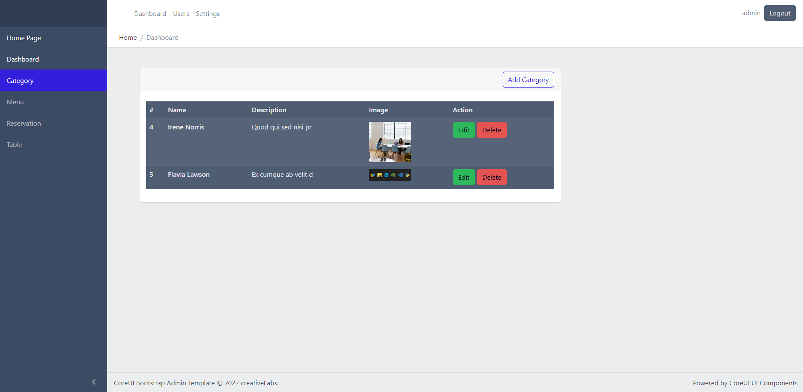
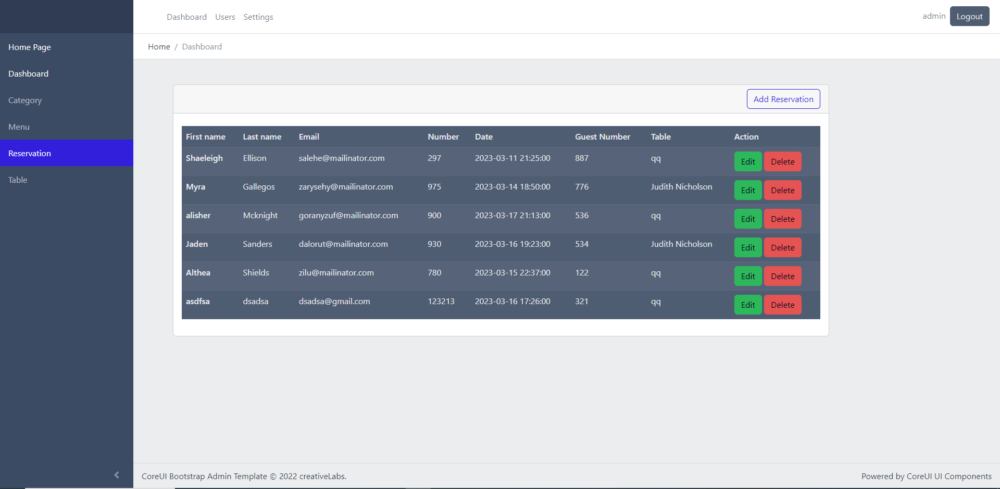
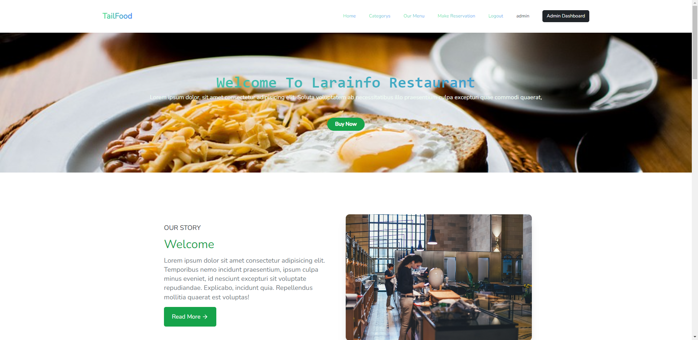
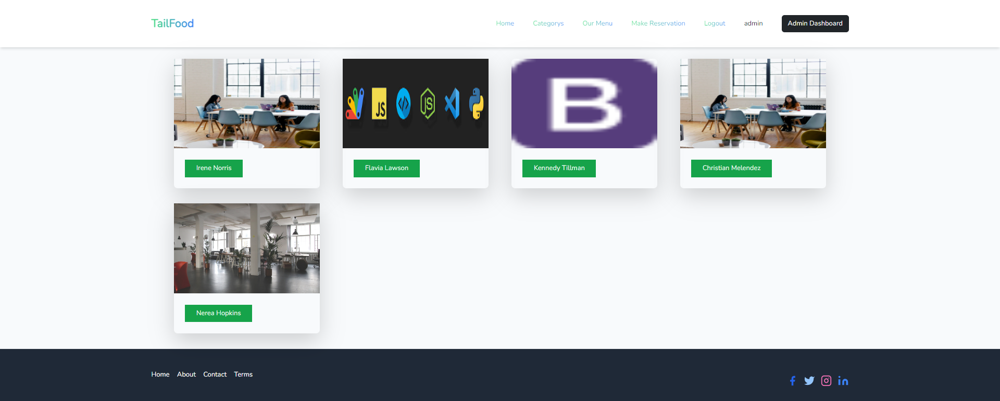
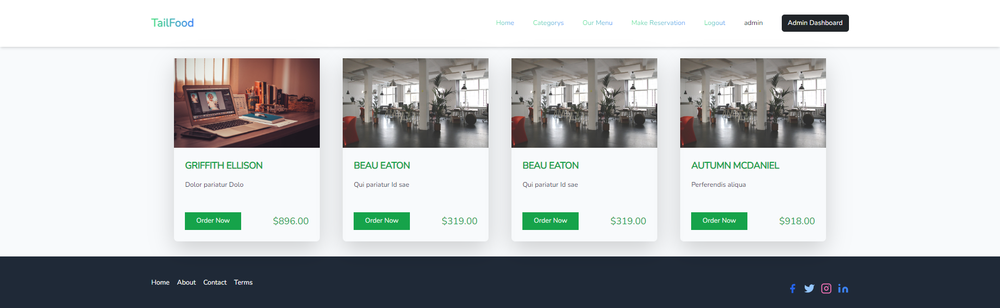
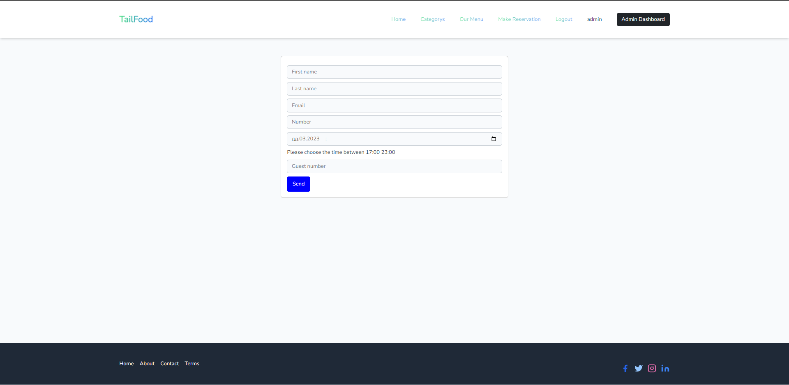

***
Food manegment system
***

```
git clone https://github.com/Alisher1504/restoran-1.git
```
```
composer install
```
```
npm install
```
```
copy .env .env.example
```
```
php artisan key:generate
```
```
php artisan migrate
```
***   


***   


***   


***   


***   


***   
